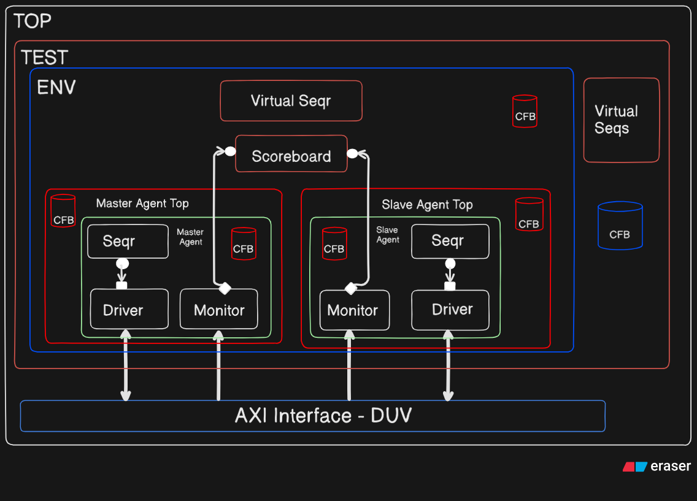

# AXI_UVM_Verification

Welcome to the AXI Verification project! This open-source repository provides a comprehensive set of verification modules and test environments for AMBA AXI (Advanced eXtensible Interface) protocols.

# AXI UVM Testbench

# AXI Block Diagram

# Testcases to be verified
1. Write burst transfers(increment & wrapping) with differnent lengths
2. Read burst transfers(increment & wrapping) with differnent lengths
3. Multiple outstanding feature
4. Narrow transfers with aligned & unaligned address
5. Out of order transaction
6. All possible response

Note: This implementation references @ShravyaSamala's AXI VIP work. The AXI RTL/Design functions as an interface with embedded assertions and properties that verify the handshaking mechanisms of signals across respective channels. The verification scope is limited to the AXI interface protocol only, with no other design elements being verified

Contributing :- We welcome contributions from the open-source community! Feel free to submit pull requests or open issues if you encounter any problems or have suggestions for improvements.

License :- This project is open-source and free to use. We ensure that all contributions comply with open-source standards, and there are no copyright infringements.

Contact :- For any inquiries or further discussions on the project, connect with me on LinkedIn at https://www.linkedin.com/in/prasannaprajapati

